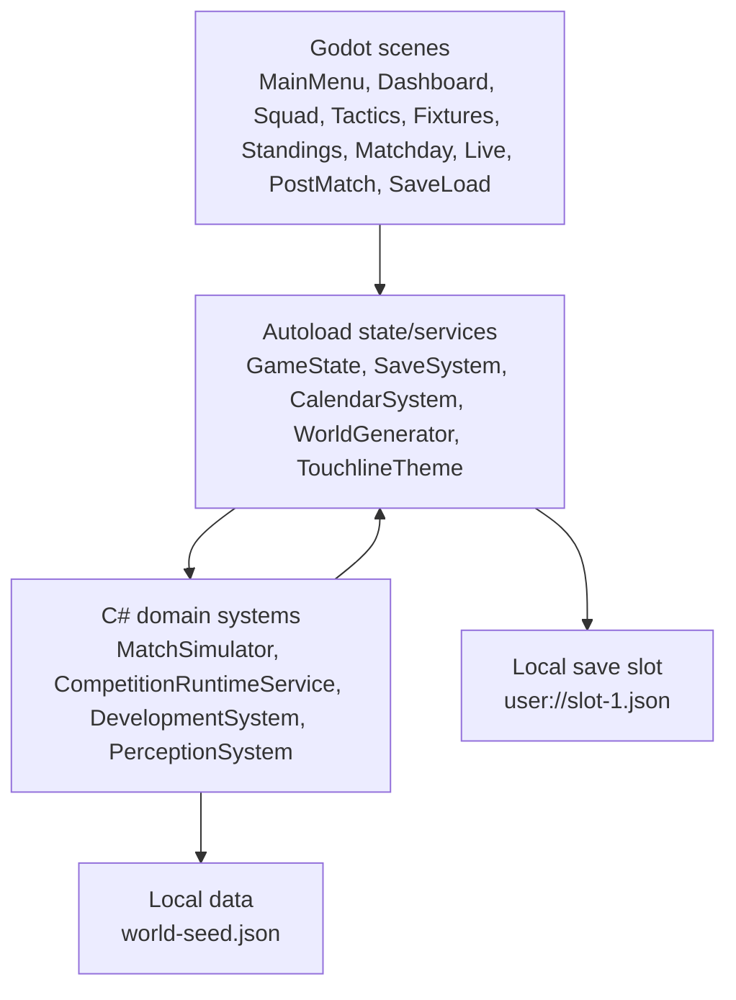

# Touchline

Local-first single-player football management game built with Godot + C#.

## Problem It Solves

Touchline gives a small but complete football management loop: start or load a career, choose a club, manage squad and tactics, read fixtures and standings, play live or instant matchdays through one shared engine, see post-match consequences, and keep the career moving through local save/load.

## Demo

- Live link: not applicable; Touchline is a local desktop Godot game.
- Executable download: placeholder, not published yet.
- Screenshots: placeholder, to be captured from the final Godot app.
- Demo video: placeholder, to be captured after final demo proof.

Planned proof assets are listed in `docs/Demo.md`.

## Features

- New career, club selection, save, load, and resume flow.
- Club dashboard with manager, season, matchday, next fixture, pressure, and squad context.
- Squad workspace with Starting XI, non-starters, player condition, form, morale, fitness, and profile handoff.
- Tactics board with formation, press, tempo, width, risk, interpretation text, and saved setup clarity.
- Fixtures and standings with completed/upcoming state, scorelines, selected-club context, and rollover visibility.
- Matchday screen with live match and instant result paths using the same shared match engine.
- Live 2D match playback with clock, score, ball/player markers, and event feed.
- Post-match report with scoreline, stats, causes, key events, pressure effects, and player-state consequences.
- Short seeded season loop with player aging/development, multi-match progression, and season rollover.

## Tech Stack

- Godot 4.6 Mono/.NET
- C#
- .NET 8 SDK
- GDScript headless regression checks
- Local JSON seed data in `game/data/world-seed.json`
- Local Godot `user://` save data

## Architecture



Scenes present state and request actions. C# domain systems own simulation, competition, progression, development, and save-compatible state changes.

## Setup

Requirements:

- Windows with Godot Mono installed
- Godot 4.6.x Mono/.NET
- .NET 8 SDK

Run from the repository root:

```powershell
dotnet build game/Touchline.sln
```

Open the project:

```powershell
Godot_v4.6.2-stable_mono_win64.exe --path game
```

Console/headless build:

```powershell
Godot_v4.6.2-stable_mono_win64_console.exe --headless --path game --build-solutions --quit
```

Representative verification:

```powershell
Godot_v4.6.2-stable_mono_win64_console.exe --headless --path game -s res://scripts/step57_final_regression_check.gd
```

Full verification groups are documented in `docs/QA.md`.

## How to Use

1. Start Touchline from Godot and choose New Career.
2. Enter a manager name, choose a seed, and select a club.
3. Use the dashboard to move between squad, player profile, tactics, fixtures, standings, and matchday.
4. Adjust lineup and tactics before matchday.
5. Choose Live Match for 2D playback or Instant Result for the same match engine without playback.
6. Review the post-match report, then continue the season.
7. Save from the dashboard and use Continue Career or Save/Load to resume locally.

## Key Technical Decisions

- Godot + C# is the active product path.
- The app is local-first and single-player; no backend or external API is required.
- Live match and instant result share one match engine.
- UI scenes do not own match, competition, save, or development rules.
- Seeded local data keeps clubs and players deterministic enough for repeatable checks.
- Legacy web code is archived/reference-only and is not the active product path.

## Limitations

- The shipped demo scale is a small seeded local league.
- No backend services, online multiplayer, playable football controls, or 3D match engine.
- No transfer market, contracts, wages, finances, scouting, injuries, promotion/relegation, youth academy, deep training, complex xG model, multi-competition calendar, licensed teams, external APIs, or tactical advice engine.
- Demo screenshots, video, and executable download are placeholders until captured/published.
- Windows export is currently a manual Godot editor workflow.

## License

MIT License
